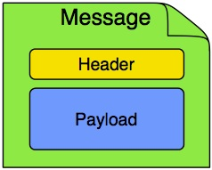

# 关键词

异步、削峰、解耦、消息分发、大事务拆分成 ``(小事务+ 异步)``、错误重试、消费者幂、分布式、**重复消费、消息丢失、顺序消费**等

# 什么是消息队列(MQ)?

> 队列是一种**先进先出**的数据结构。但是作为中间件，跟单机中的队列是不一样的。 毫无疑问，单机的队列是无法满足需求的，集群/分布式。 消除了单点故障、保证消息可靠性等。消息队列可以简单理解为：**把要传输的数据放在队列中**。消息队列做业务解耦/最终一致性/广播/错峰流控等。反之，如果需要强一致性，关注业务逻辑的处理结果，则RPC显得更为合适。

## 名称定义

+ 消费者: 
+ 生产者

## 优点

###  解耦

> 作为一个订单系统，我们可以需要在创建订单、有库存信息或者有物流信息调用其它子系统。耦合严重。如某个系统挂了，导致该接口异常。将消息发送到队列中，需要使用的系统，去订阅的方式。

### 异步

> 非必要的操作，异步去处理。而不是同步。比如下单支付完之后，发送等短信，发送短信的结果不应该影响 用户下单，这样异步化，可以提供接口qps。当然，异步的方式有很多，比如你开启线程池处理等。

### 削峰

> 在秒杀或者有活动的时候，通过先把请求放到队列里面，然后至于每秒消费多少请求，就看自己的**服务器处理能力**，你能处理5000QPS你就消费这么多，可能会比正常的慢一点，但是**不至于打挂服务器**。等活动结束之后，可以慢慢消费队列中的数据。比如3更半夜去消费等。比如常见的压单等操作

## 缺点

### **数据一致性**

> 下单的服务自己保证自己的逻辑成功处理了，你成功发了消息，但是优惠券系统，积分系统等等这么多系统，**他们成功还是失败你就不管了？** 
>
> 这里就涉及到分布式事务、最终一致性性等问题。

### 可用性

> 复杂度增加，要考虑 分布式服务的可用性。

## 适用场景

> 消息队列做业务解耦/最终一致性/广播/错峰流控等。反之，如果需要强一致性，关注业务逻辑的处理结果，则RPC显得更为合适。

### 上游不关心下游的执行结果

> 生产者不需要从消费者处获得反馈。如同步数据、发送通知。

### 容许短暂的不一致性

## 技术选型对比

### 主流MQ对比

### RocketMQ与Kafka对比

#### 数据可靠性

- RocketMQ支持异步实时刷盘，同步刷盘，同步Replication，异步Replication

- Kafka使用异步刷盘方式，异步Replication/同步Replication

RocketMQ的同步刷盘在单机可靠性上比Kafka更高，不会因为操作系统Crash，导致数据丢失。

Kafka同步Replication理论上性能低于RocketMQ的同步Replication，原因是Kafka的数据以分区为单位组织，意味着一个Kafka实例上会有几百个数据分区，RocketMQ一个实例上只有一个数据分区，RocketMQ可以充分利用IO Group Commit机制，批量传输数据，配置同步Replication与异步Replication相比，性能损耗约20%~30%

#### 性能对比

- Kafka单机写入TPS约在百万条/秒，消息大小10个字节

- RocketMQ单机写入TPS单实例约7万条/秒，单机部署3个Broker，可以跑到最高12万条/秒，消息大小10个字节

Kafka的TPS跑到单机百万，主要是由于Producer端将多个小消息合并，批量发向Broker。

RocketMQ为什么没有这么做？

1. Producer通常使用Java语言，缓存过多消息，GC是个很严重的问题
2. Producer调用发送消息接口，消息未发送到Broker，向业务返回成功，此时Producer宕机，会导致大量消息丢失，业务出错
3. Producer通常为分布式系统，且每台机器都是多线程发送，我们认为线上的系统单个Producer每秒产生的数据量有限，不可能上万。
4. 缓存的功能完全可以由上层业务完成。

#### 单机支持的队列数

- Kafka单机超过64个队列/分区，Load会发生明显的飙高现象，队列越多，load越高，发送消息响应时间变长。

- RocketMQ单机支持最高5万个队列，Load不会发生明显变化

队列多有什么好处？

单机可以创建更多Topic，因为每个Topic都是由一批队列组成

Consumer的集群规模和队列数成正比，队列越多，Consumer集群可以越大

#### 严格的消息顺序

- Kafka支持消息顺序，但是一台Broker宕机后，就会产生消息乱序

- RocketMQ支持严格的消息顺序，在顺序消息场景下，一台Broker宕机后，发送消息会失败，但是不会乱序

#### 分布式事务消息

- Kafka不支持分布式事务消息

- 阿里云ONS支持分布式定时消息，未来开源版本的RocketMQ也有计划支持分布式事务消息

#### 消息查询

- Kafka不支持消息查询

- RocketMQ支持根据Message Id查询消息，也支持根据消息内容查询消息（发送消息时指定一个Message Key，任意字符串，例如指定为订单Id）

# 最佳实践

## 统一消息格式

> 消息由header和message由两部分组成。

   id：由生产者生成，每次不重复，代表一条消息。消费者可用于做幂等。

   timestamp：消息的创建时间，消费方可根据业务需求，拒绝某个时间点前的消息。

   traceId: 链路id，用于追溯业务链路。

   payload：业务数据。

## 文档编写

> 写清每个服务使用的中间件名称、队列名称、主题名称、消息内容、消息的来源与去处。

## 考虑点

+ 发送方式的选择： 
+ 刷盘策略

+ MQ不可用时，消息发送失败。如何保证消息不丢失？如何降级？何时重发？（写文件、记录数据库、定时扫描）
+ MQ由于网络原因，可能会出现重投的情况。重投分为两种情况，1种情况是生产者同个消息发送了两次或以上，此时header头的id唯一，MQ的messageId不唯一。第2种情况是消费方消费完成后响应给MQ时出现网络异常，MQ会间隔一段时间后进行重投，此时header头的id不变，MQ的messageId也不变。所以针对这两种情况，可使用id做幂等，将消费完成的id保持到数据库。如果业务自带幂等功能，可不做这块逻辑。
+ 消费方订阅消息时，需指定好需要的Tag。不要订阅 *，否则可能会收到很多无用的消息。
+ 如果产生了无法消费的消息，可能会导致消费方频繁的报错。消费方需要抛弃这条消息，就要上代码，指定消息id才能抛弃。如果不想这么做，就需要统一配置服务。用一个配置项来指定即可。

# 扩展

## 分布式事务MQ方案

#### 1、本地消息表

本地消息表这种实现方式应该是业界使用最多的，其核心思想是将分布式事务拆分成本地事务进行处理，这种思路是来源于ebay。我们可以从下面的流程图中看出其中的一些细节：

基本思路就是：

消息生产方，需要额外建一个消息表，并记录消息发送状态。消息表和业务数据要在一个事务里提交，也就是说他们要在一个数据库里面。然后消息会经过MQ发送到消息的消费方。如果消息发送失败，会进行重试发送。

消息消费方，需要处理这个消息，并完成自己的业务逻辑。此时如果本地事务处理成功，表明已经处理成功了，如果处理失败，那么就会重试执行。如果是业务上面的失败，可以给生产方发送一个业务补偿消息，通知生产方进行回滚等操作。

#### 2、[可靠消息最终一致性方案（MQ事务消息）](https://zhuanlan.zhihu.com/p/105520315)

主要用来保证本地事务和消息发送，要么同时成功要么同时失败。

- 半事务消息：暂不能投递的消息，发送方已经成功地将消息发送到了消息队列 RocketMQ 版服务端，但是服务端未收到生产者对该消息的二次确认，此时该消息被标记成“暂不能投递”状态，处于该种状态下的消息即半事务消息。
- 消息回查：由于网络闪断、生产者应用重启等原因，导致某条事务消息的二次确认丢失，消息队列 RocketMQ 版服务端通过扫描发现某条消息长期处于“半事务消息”时，需要主动向消息生产者询问该消息的最终状态（Commit 或是 Rollback），该询问过程即消息回查。

# [消息队列设计精要](https://zhuanlan.zhihu.com/p/55712984)

# 引用

[^消息队列基础]: https://github.com/AobingJava/JavaFamily/blob/master/docs/mq/%E6%B6%88%E6%81%AF%E9%98%9F%E5%88%97%E5%9F%BA%E7%A1%80.md
[^如何设计一个消息队列]: https://zhuanlan.zhihu.com/p/21479556
[^消息队列的使用场景介绍]: https://zhuanlan.zhihu.com/p/55712984
[^一个基于rabbitMQ的可靠事务消息解决方案]: https://zhuanlan.zhihu.com/p/105520315

[原理解析PDF](./static/RocketMQ实战与原理解析.pdf)

[MQ最佳实践_12_07修改版本](./static/MQ最佳实践_12_07修改版本.pdf)

[RocketMQ.pptx](./static/RocketMQ.pptx)

# 待学习列表

[starter](http://wiki.qudian.com/pages/viewpage.action?pageId=44248849)

[rocketmq](https://github.com/AobingJava/JavaFamily/blob/master/docs/mq/RocketMQ.md)

[消息队列设计概要](https://zhuanlan.zhihu.com/p/21479556)

[可靠性事务消息解决方案](https://zhuanlan.zhihu.com/p/105520315)

